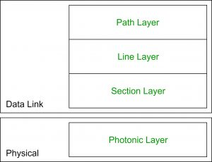

# COMPUTER NETWORKS

[Link to Cheatsheet](https://whimsical.com/networking-cheatsheet-by-love-babbar-FcLExFDezehhfsbDPfZDBv)

**Computer Networks:** A computer network is a system that connects two or more computing devices for transmitting and sharing information.

**Computer Networking:** Computer Networking refers to connect computing devices to ever expanding array of IoT devices.

# BASICS
## How does a computer network work?
Specialised devices such as switches, routers and access points for the foundation of Computer Networks.

* **Switches**: Switches help to connect devices in a network to each other enabling them to talk with each other by exchanging data packets.
*A layer 2 switch uniquely identifies a device by its burned in MAC-address.*
* **Routers**: Routers helps connect different networks. They analyze data to be sent across a network, choose the best route for it and then send them on their way.
*A layer 3 router uniquely identifies a device's network connection with a network assigned IP address.*

## Types of Computer Networks
1.  **Local Area Network (LAN):** It is a collection of connected devices in one physical location. May include both wired and wireless devices.
2. **Wide Area Network (WAN):** A WAN extends over large areas and connects various individual users or various LANs. Various organisations used WAN to connect their different     sites, remote employees, suppliers, and data centers etc. *Eg: Internet*
3. Others such as **PANs**(Personal Area Network) and **MANs**(Metropolitan Area Network).
3. **Enterprise Network:** A network built for a large organisation. Since networking is crucial for any modern enterprise to function, enterprise networks must be highly available, scalable, and robust. These networks have tools that enable network engineers and operators to design, deploy, debug, and remediate them. Enterprise may use both LANs and WANs accross their campus, branches and data center.
4. **Service-provider Network:** Service providers operate WANs to provide connectivity to various individual users or organisation.

## Basic Terminologies
* **Client:** A client is a computer hardware device or software that accesses a service made available by a server.
* **Server:** A server is a physical computer dedicated to run services for other computers or devices connected to servers.
* **Host:** A host is computer connected to other computers, for which it provides data or services over a network. *A host must have assigned IP Address. (Therefore modems, hubs, and switches are not considered as hosts.)*
* **Peer:** In simple terms, a peer is any device that participates in a network and has the same functionality as one or more devices in the network. Peers share similar functionalities or responsibilities.
* **Bandwidth:** Network bandwidth is a measurement indicating the maximum capacity of a wired or wireless communications link to transmit data over a network connection in a given amount of time. Bandwidth decribes data transfer rates. Multiple devices using the same connection must share bandwidth.

To access a server, you should know that if it has a public IP address or private IP address. Public one can be accessed directly through web, but Private one can only be accessed through your private LANs.
 

> NOTE: The speed at which a client can retrieve data from a server is dependent on the amount of bandwidth required to transfer the data.

* **Packet:** Any data sent over the internet is divided into smaller segments called packets. These packets are then recombined by the device which recieves them with the help of packet-header.
* **Jitter:** Information are transported in form of data packets accross the internet. They are usually sent at regular intervals of time. Jitter is when there is delay in sending over these data packets. May happen due to network congestion. 

> NOTE: In VoIP (Voice over Internet Protocol), your voice is converted into data packets and then are transmitted over internet.

> For A delay of around 30 ms or more can result in distortion and disruption to a call. For video streaming to work efficiently, jitter should be below 30 ms.

* **Frame:** In networking, a frame is a unit of data.Frame is a formatting resource for data that needs to be split up into recognizable pieces in order to be interpreted by a receiver.

* **Local Host:** When you call the IP Address 127.0.0.1, you are communicating with the local host. Local host is always your computer. If you access “http://localhost” in the browser, the request will not be forwarded to the internet through the router. It will instead remain in your system.

* **Bit Rate** (Speed at which bits are transferred), 
**Noise** (Unwanted Signals), **Attenuation** (Loss of signal strength in networking cables or connections.), **Distortion** (Interruption of transmitting signals that cause an unclear reception.)

## Web and Internet
The Internet is a global network of networks while the Web, also referred to formally as World Wide Web (www) is a collection of information that is accessed via the Internet. Another way to look at this difference is; the Internet is infrastructure while the Web is served on top of that infrastructure.

## Types of Transmission Media
Guided Media - Wired or Bounded Transmission media      
Unguided Media - Wireless or Unbounded Transmission Media

## Unicast, Broadcast and Multicast
| Feature     | Unicast                                                       | Broadcast                                       | Multicast                                      |
|-------------|---------------------------------------------------------------|-------------------------------------------------|------------------------------------------------|
| Definition  | A communication where a message is sent from one sender to one receiver. | A communication where a message is sent from one sender to all receivers. | A communication where a message is sent from one sender to a group of receivers |
| Transmission | Data is sent to a single recipient                            | Data is sent to all recipients in a network    | Data is sent to a group of recipients         |
| Addressing  | Uses a unique destination address                             | Uses a special broadcast address               | Uses a special multicast address              |
| Delivery    | Guaranteed delivery                                           | Not all devices may be interested in the data | Not all devices may be interested in the data |
| Network Traffic | Generates the least amount of network traffic                | Generates the most amount of network traffic  | Generates moderate network traffic            |
| Security    | More secure because data is sent to a specific recipient     | Less secure because data is sent to all devices in the network | Moderately secure because data is sent to a specific group of devices |
| Examples    | Email, file transfer                                         | DHCP requests, ARP requests                    | Video streaming, online gaming                |
| Destination | Single receiver                                               | All receivers                                  | Group of receivers                            |
| Bandwidth usage | Moderate                                                   | High                                            | Moderate                                       |
| Latency     | Low                                                           | High                                            | Moderate                                       |

## Types of Topology
Network topologies describe the methods in which all the elements of a network are mapped. The topology term refers to both the physical and logical layout of a network.
1. **P2P (Point to Point) Topology:** Network consists of direct link between two computers. *Faster and highly reliable, but can only be used for very small areas where computers are in close proximity. And also offers no security.*

2. **Bus Topology:** Uses a single cable which connects all the included node. One of the computers in the network acts as the computer server. *Widely used when a network installation is small, simple, or temporary. One of the passive topologies. So computers on the bus only listen for data being sent. But, in case if the common cable fails, then the entire system will crash down. When network traffic is heavy, it develops collisions in the network.*
  

3. **Ring Topology:** Every device has exactly two neighboring devices for communication purpose.
*Easy to install and reconfigure. Adding or deleting a device in-ring topology needs you to move only two connections. But, failure of one computer can disturb the whole network. In the ring, topology signals are circulating at all times, which develops unwanted power consumption.*

4. **Star Topology:** All the computers connect with the help of a hub. This cable is called a central node, and all other nodes are connected using this central node.
*Easy to troubleshoot, set up, and modify. Only those nodes are affected, that has failed. Other nodes still work. Addition, deletion, and moving of the devices are easy. But, if the hub or concentrator fails, attached nodes are disabled. Cost of installation of star topology is costly.*

5. **Mesh Topology:** The mesh topology has a unique network design in which each computer on the network connects to every other. It is develops a P2P (point-to-point) connection between all the devices of the network. There can be partial mesh topology and full mesh topology. *The network can be expanded without disrupting current users.No traffic problem as nodes has dedicated links. A mesh topology is robust. But, installation is complex because every node is connected to every node. It is expensive due to the use of more cables. No proper utilization of systems.*

Partial Mesh                |  Full Mesh
:-------------------------:|:-------------------------:
|
 
6. **Tree Topology:** Tree topologies have a root node, and all other nodes are connected which form a hierarchy. So it is also known as hierarchical topology. *Failure of one node never affects the rest of the network. Node expansion is fast and easy. Detection of error is an easy process. But, it is heavily cabled topology. If more nodes are added, then its maintenance is difficult* 

7. **Hybrid Topology:** Mixture of all sorts of topologies.
*Offers the easiest method for error detecting and troubleshooting. Highly effective and flexible networking topology. It is scalable so you can increase your network size. But, the design of hybrid topology is complex. It is one of the costliest processes*

------------------------
# OSI Model
The OSI model (Open System Interconnection Model) is a conceptual framework used to describe the functions of a networking system. The OSI model characterizes computing functions into a universal set of rules and requirements in order to support interoperability between different products and software.

## The 7 Layers of OSI Model
### 1. Physical Layer
The lowest layer of the OSI Model is concerned with electrically or optically transmitting raw unstructured data bits across the network from the physical layer of the sending device to the physical layer of the receiving device. It can include specifications such as voltages, pin layout, cabling, and radio frequencies. At the physical layer, one might find “physical” resources such as network hubs, cabling, repeaters, network adapters or modems.

### 2. Data Link Layer
At the data link layer, directly connected nodes are used to perform node-to-node data transfer where data is packaged into frames. The data link layer also corrects errors that may have occurred at the physical layer.
**Two Sub-Layers**
1. *Media Access Control (MAC):* Facilitating efficient communication between devices on a network through managing data flow and channel allocation.
2. *Logic Link Control (LLC):* Provides flow and error control over the physical medium as well as identifies line protocol.

### 3. Network Layer
This layer is responsible for recieving frames from data link layer, and delivering them to their intended destination. It finds destination using logical addresses, such as Internet Protocol (IP). At this layer, router are crucial components.

### 4. Transport Layer
The transport layer manages the delivery and error checking of the data packets. It regulates the size, sequencing, and ultimately the transfer of data between hosts and systems/recievers. One of the most famous transport layer is TCP *(Transmission Control Protocol)*

### 5. Session Layer
It controls the conversation between different layers. A session or connection between machines is set up, managed, and terminated at layer 5. Session layer services also include authentications and reconnections.

### 6. Presentation Layer
The presentation layer formats or translates data for the application layer based on the syntax or semantics that the application accepts. Because of this, it at times also called the **syntax layer**. This layer can also handle the encryption and decryption required by the application layer.

### 7. Application Layer
At this layer, both the user and application layer interact directly with the software. The presentation layer formats or translates data for the application layer based on the syntax or semantics that the application accepts. Because of this, it at times also called the syntax layer. This layer can also handle the encryption and decryption required by the application layer.

## Data Link Layer Terminologies and Related Things 
### Difference between Internet, Intranet and Extranet
| Point of difference | Internet | Intranet | Extranet |
|---------------------|----------|----------|----------|
| Accessibility of network | Public | Private | Private |
| Availability | Global system | Specific to an organization | To share information with suppliers and vendors it makes the use of public network |
| Coverage | All over the world | Restricted area up to an organization | Restricted area up to an organization and some of its stakeholders or so |
| Accessibility of content | It is accessible to everyone connected | It is accessible only to the members of organization | Accessible only to the members of organization and external members with logins |
| No. of computers connected | It is largest in number of connected devices | The minimal number of devices are connected | The connected devices are more comparable with Intranet |
| Owner | No one | Single organization | Single/ Multiple organization |
| Purpose of the network | It’s purpose is to share information throughout the world | It’s purpose is to share information throughout the organization | It’s purpose is to share information between members and external, members |
| Security | It is dependent on the user of the device connected to network | It is enforced via firewall | It is enforced via firewall that separates internet and extranet |
| Users | General public | Employees of the organization | Employees of the organization which are connected |
| Policies behind setup | There is no hard and fast rule for policies | Policies of the organization are imposed | Policies of the organization are imposed |
| Maintenance | It is maintained by ISP | It is maintained by CIO, HR or communication department of an organization | It is maintained by CIO, HR or communication department of an organization |
| Economical | It is more economical to use | It is less economical | It is also less economical |
| Relation | It is the network of networks | It is derived from Internet | It is derived from Intranet |
| Example | What we are normally using is internet | WIPRO using internal network for its business operations | DELL and Intel using network for its business operations |

### Virtual Circuits -
* Also known as connection-oriented switching.  
* It is connection-oriented, meaning that there is a reservation of resources like buffers, CPU, bandwidth etc. for the time in which the newly set VC is going to be used by a data transfer session.  
* The first sent packet reserves resources at each server along the path. Subsequent packets will follow the same path as the first sent packet for the connection time.
* First packet of the connection requires a global header, so that all subsequent packets may follow. The packets are recieved in order at the destination.

> Used by the ATM (Asynchronous Transfer Mode) Network, specifically for Telephone calls.

**Types of Virtual Circuits:** 
1. *PVC (Permanent Virtual Circuits):* The main use for these always-on circuits is high-speed communication. PVCs require telco resources (switches) to be allocated to a single communication circuit whether or not that circuit is in use, making them an expensive solution for wide-area networks (WANs).
2. *SVC (Switched Virtual Circuits):* SVCs are released at the conclusion of the session and can be used to create new channels of communication. This is the process of normal phone communication. SVCs, which are billed on a per-minute basis, are generally utilised in WANs when backups to dedicated leased lines are required.

### Datagram Networks - 
* It is a connection-less service. Therefore, there is no need for reservation of resources.
* All packets are free to use any available path. Therefore, intermediate routers calculate route on the go.
* Data packets can reach the destination in any order. 
* *Major drawback* is that the data packets can only be forwarded if there is an availability of resources such as buffer, CPU and bandwidth, otherwise they are discarded.
* All the data packets require individual headers containing information.
* Easy and cost efficient method to setup.

***MAIN DIFFERENCES :***
| Criteria             | Virtual Circuit Networks                                                 | Datagram Networks                                                      |
|----------------------|-------------------------------------------------------------------------|-------------------------------------------------------------------------|
| Connection Establishment | Prior to data transmission, a connection is established between sender and receiver. | No connection setup is required.                                       |
| Routing              | Routing decisions are made once during connection setup and remain fixed throughout the duration of the connection. | Routing decisions are made independently for each packet and can vary based on network conditions. |
| Flow Control         | Uses explicit flow control, where the sender adjusts its rate of transmission based on feedback from the receiver. | Uses implicit flow control, where the sender assumes a certain level of available bandwidth and sends packets accordingly. |
| Congestion Control   | Uses end-to-end congestion control, where the sender adjusts its rate of transmission based on feedback from the network. | Uses network-assisted congestion control, where routers monitor network conditions and may drop packets or send congestion signals to the sender. |
| Error Control        | Provides reliable delivery of packets by detecting and retransmitting lost or corrupted packets. | Provides unreliable delivery of packets and does not guarantee delivery or correctness. |
| Overhead             | Requires less overhead per packet because connection setup and state maintenance are done only once. | Requires more overhead per packet because each packet contains information about its destination address and other routing information. |
| Example Protocol     | ATM, Frame Relay                                                         | IP (Internet Protocol)                                                 |

### Switches and their types
Switches are the connectivity points of an Ethernet Network.These are small devices that can receive data from multiple input ports and send it to the specific output port that takes data to its intended destination in the network.

1. **Unmanaged Switches:** These switches do not need to be monitored or configured. They plug in and start doing their work. Allows devices on a network to connect with each other.
2. **Managed Switches:** These types of switches have many features like the highest levels of security, precision control, and full management of the network. These are used in organizations containing a large network and can be customized to enhance the functionality of a certain network. They are achieved by setting a simple network management protocol(SNMP).
There are two types: 
    
        I. Smart switches: These switches offer basic management features with the ability to create some levels of security but have a simpler management interface than the other managed switches. Mostly used in fast and constant LANs. Also can accept the configuration of VLANs (Virtual LANs).
        
        II. Enterprise-managed switches: They have features like the ability to fix, copy, transform and display different network configurations, along with a web interface SNMP agent and command-line interface

* **LAN switches**: These are also known as Ethernet switches or data switches and are used to reduce network congestion or bottleneck by distributing a package of data only to its intended recipient. These are used to connect points on a LAN.  

* **PoE switches**: PoE switches are used in PoE technology which stands for *power over Ethernet* that is a technology that integrates data and power on the same cable allowing power devices to receive data in parallel to power. Thus these switches provide greater flexibility by simplifying the cabling process. 

### What is VLAN?
VLAN is a custom network which is created from one or more local area networks. It enables a group of devices available in multiple networks to be combined into one logical network. The result becomes a virtual LAN that is administered like a physical LAN. The full form of VLAN is defined as Virtual Local Area Network.
It increases the broadcast domains possible in a LAN. Changing hosts/users on a VLAN is relatively easy. It just needs a new port-level configuration.
#### Types of VLAN
1. **Port-Based VLAN:** Groups virtual local area network by port. In this type of virtual LAN, a switch port can be configured manually to a member of VLAN. 
2. **Protocol-Based VLAN:** This type of VLAN processes traffic based on a protocol that can be used to define filtering criteria for tags, which are untagged packets.
In this Virtual Local Area Network, the layer-3 protocol is carried by the frame to determine VLAN membership. Not a very practical method.
3. **MAC-Based VLAN:** MAC Based VLAN allows incoming untagged packets to be assigned virtual LAN and, thereby, classify traffic depending on the packet source address. You define a Mac address to VLAN mapping by configuring mapping the entry in MAC to the VLAN table.

### Basics of WiFi (Wireless Fidelity)
It is a technology for wireless local area networking with devices based on IEEE 802.11 standards. Wi-Fi compatible devices can connect to the internet via WLAN network and a wireless access point abbreviated as AP.
Access Point(AP) is a wireless LAN base station that can connect one or many wireless devices simultaneously to internet.

The architecture of this standard has 2 kinds of service:
1. **Basic Service Set (BSS):** BSS is the basic building block of WLAN. It is made of wireless mobile stations and an optional central base station called Access Point. A BSS without an AP cannot send data to other BSSs and defines a standalone network. It is called Ad-hoc network or Independent BSS(IBSS).i.e A BSS without AP is an ad-hoc network.
2. **Extended Service Set (ESS):** Is made up of 2 or more BSSs with APs. BSSs are connected to the distribution system via their APs. The distribution system can be any IEEE LAN such as Ethernet.   ESS has 2 kinds of stations: 
    1. *Mobile* – stations inside the BSS 
    2. *Stationary* – AP stations that are part of wired LAN.

## Network Layer Terminologies and Related Things 
### IP (Internet Protocol) Address
An IP address is a unique address that identifies a device on the internet or a local network. It is a set of rules that govern the format of data sent via the internet or local network. 

An IP address is a string of numbers separated by periods. IP addresses are expressed as a set of four numbers. Each number in the set can range from 0 to 255. Therefore, IP address can range from 0.0.0.0 to 255.255.255.255. Eg: 192.159.1.38

Each part before the period is called octet.

> **NOTE**: IP addresses are not random. They are mathematically produced and allocated by the Internet Assigned Numbers Authority (IANA), a division of the Internet Corporation for Assigned Names and Numbers (ICANN).

#### Types of IP Addresses
1. **Consumer IP Address:** Every individual with an internet service has two types of IP Address. 
    
    1. *Private IP Address:*  Every device that connects to your internet network has a private IP address. This includes computers, smartphones, and tablets but also any Bluetooth-enabled devices like speakers, printers, or smart TVs. 
    2. *Public IP Address:* A public IP address is the primary address associated with your whole network. Your public IP address is provided to your router by your ISP. Typically, ISPs have a large pool of IP addresses that they distribute to their customers. Your public IP address is the address that all the devices outside your internet network will use to recognize your network. It has two types:  
        1.  **Dynamic IP Address:** Dynamic IP addresses change automatically and regularly. ISPs buy a large pool of IP addresses and assign them automatically to their customers. Periodically, they re-assign them and put the older IP addresses back into the pool to be used for other customers.
        2. **Static IP Address:** In static IP Address, Once the network assigns an IP address, it remains the same. Most individuals and businesses do not need a static IP address, but for businesses that plan to host their own server, it is crucial to have one.

2. **Website IP Address/:** For website owners who don’t host their own server, and instead rely on a web hosting package – which is the case for most websites – there are two types of website IP addresses.
    1. *Shared IP Address:* Websites that rely on shared hosting plans from web hosting providers will typically be one of many websites hosted on the same server. Tends to be the case with individual websites, where traffic volumes are manageable. Websites hosted this way will have shared IP Address.  
    2. *Dedicated IP Address:* Some web hosting plans have the option to purchase a dedicated IP address (or addresses). This can make obtaining an SSL certificate easier and allows you to run your own File Transfer Protocol (FTP) server. This makes it easier to share and transfer files with multiple people within an organization and allow anonymous FTP sharing options.

### IPv4 v/s IPv6

| Basis for differences                 | IPv4                                                                                           | IPv6                                                                                     |
|---------------------------------------|-----------------------------------------------------------------------------------------------|------------------------------------------------------------------------------------------|
| Size of IP address                    | IPv4 is a 32-Bit IP Address.                                                                   | IPv6 is 128 Bit IP Address.                                                              |
| Addressing method                     | IPv4 is a numeric address, and its binary bits are separated by a dot (.)                      | IPv6 is an alphanumeric address whose binary bits are separated by a colon (:). It also contains hexadecimal. |
| Number of header fields               | 12                                                                                            | 8                                                                                        |
| Length of header field                | 20                                                                                            | 40                                                                                       |
| Checksum                              | Has checksum fields                                                                           | Does not have checksum fields                                                            |
| Example                               | 12.244.233.165                                                                                | 2001:0db8:0000:0000:0000:ff00:0042:7879                                                  |
| Type of Addresses                     | Unicast, broadcast, and multicast.                                                            | Unicast, multicast, and anycast.                                                         |
| Number of classes                     | IPv4 offers five different classes of IP Address. Class A to E.                                | IPv6 allows storing an unlimited number of IP Address.                                   |
| Configuration                         | You have to configure a newly installed system before it can communicate with other systems.  | In IPv6, the configuration is optional, depending upon functions needed.                 |
| VLSM support                          | IPv4 support VLSM (Variable Length Subnet mask).                                              | IPv6 does not offer support for VLSM.                                                    |
| Fragmentation                         | Fragmentation is done by sending and forwarding routes.                                       | Fragmentation is done by the sender.                                                     |
| Routing Information Protocol (RIP)    | RIP is a routing protocol supported by the routed daemon.                                     | RIP does not support IPv6. It uses static routes.                                         |
| Network Configuration                 | Networks need to be configured either manually or with DHCP. IPv4 had several overlays to handle Internet growth, which require more maintenance efforts. | IPv6 supports autoconfiguration capabilities.                                           |
| Best feature                          | Widespread use of NAT (Network address translation) devices which allows single NAT address to mask thousands of non-routable addresses, making end-to-end integrity achievable. | It allows direct addressing because of vast address space.                               |
| Address Mask                          | Used for the designated network from the host portion.                                        | Not used.                                                                                |
| SNMP                                  | SNMP is a protocol used for system management.                                                | SNMP does not support IPv6.                                                              |
| Mobility & Interoperability           | Relatively constrained network topologies restrict mobility and interoperability capabilities. | IPv6 provides interoperability and mobility capabilities which are embedded in network devices. |
| Security                              | Security is dependent on applications – IPv4 was not designed with security in mind.          | IPSec (Internet Protocol Security) is built into the IPv6 protocol, usable with a proper key infrastructure. |
| Packet size                           | Packet size 576 bytes required, fragmentation optional                                        | 1208 bytes required without fragmentation                                                |
| Packet fragmentation                  | Allows from routers and sending host                                                          | Sending hosts only                                                                       |
| Packet header                         | Does not identify packet flow for QoS handling which includes checksum options.               | Packet header contains Flow Label field that specifies packet flow for QoS handling.     |
| DNS records                           | Address (A) records, maps hostnames                                                           | Address (AAAA) records, maps hostnames                                                   |
| Address configuration                 | Manual or via DHCP                                                                            | Stateless address autoconfiguration using Internet Control Message Protocol version 6 (ICMPv6) or DHCPv6 |
| IP to MAC resolution                  | Broadcast ARP                                                                                 | Multicast Neighbour Solicitation                                                          |
| Local subnet Group management         | Internet Group Management Protocol (IGMP)                                                     | Multicast Listener Discovery (MLD)                                                       |
| Optional Fields                       | Has Optional Fields                                                                           | Does not have optional fields. But Extension headers are available.                      |
| IPSec                                 | Internet Protocol Security (IPSec) concerning network security is optional                    | Internet Protocol Security (IPSec) concerning network security is mandatory               |
| Dynamic host configuration Server     | Clients have to approach DHCS (Dynamic Host Configuration server) whenever they want to connect to a network. | A client does not have to approach any such server as they are given permanent addresses. |
| Mapping                               | Uses ARP (Address Resolution Protocol) to map to MAC address                                  | Uses NDP (Neighbour Discovery Protocol) to map to MAC address                            |
| Compatibility with mobile devices     | IPv4 address uses the dot-decimal notation. That’s why it is not suitable for mobile networks. | IPv6 address is represented in hexadecimal, colon-separated notation. IPv6 is better suited to mobile networks. |

### Network and Host Portion of an IP Address
Remove all portions of the IP address that correspond to the positions of ones of the subnet mask, and then that will be your network portion, the rest will be your host portion.

Relationship between subnet mask and number of hosts and networks

### Supernet
Supernetting is the process of aggregating routes to multiple smaller networks. Thus saving storage space in the routing table, simplifying routing decisions, and reducing route advertisements to neighboring gateways. It is opposite of subnet. 

In subnetting we convert host bits to networking bits, but in supernetting we convert host bits to network bits.

#### Important Points for Supernetting 
* All the Networks should be contiguous. 
* The block size of every network should be equal and must be in form of 2n. 
* First Network id should be exactly divisible by whole size of supernet. 

### Types of Routing
Routing is a process that is performed by layer 3 (or network layer) devices in order to deliver the packet by choosing an optimal path from one network to another.

1. **Static Routing:** Process in which we have to manually add routing paths to the router

    <ins>Advantages</ins>
    * No routing overhead for the router CPU which means a cheaper router can be used to do routing. 
    * It adds security because only an only administrator can allow routing to particular networks only. 
    * No bandwidth usage between routers. 

    <ins>Disadvantages</ins> 
    * For a large network, it is a hectic task for administrators to manually add each route for the network in the routing table on each router. 
    * The administrator should have good knowledge of the topology. If a new administrator comes, then he has to manually add each route so he should have very good knowledge of the routes of the topology. 

2. **Default Routing:** This is the method where the router is configured to send all packets toward a single router (next hop). It doesn’t matter to which network the packet belongs, it is forwarded out to the router which is configured for default routing. It is generally used with stub routers. A stub router is a router that has only one route to reach all other networks. 

3. **Dynamic Routing:** Dynamic routing makes automatic adjustments of the routes according to the current state of the route in the routing table. Dynamic routing uses protocols to discover network destinations and the routes to reach them. RIP *(Routing Information Protocol)* and OSPF *(Open Shortest Path First)* are the best examples of dynamic routing protocols.

    <ins>Advantages 
    * Easy to configure. 
    * More effective at selecting the best route to a destination remote network and also for discovering remote networks. 
    
    <ins>Disadvantage 
    * Consumes more bandwidth for communicating with other neighbors. 
    * Less secure than static routing. 

### Network Address Translation
The idea of NAT is to allow multiple devices to access the Internet through a single public address. Network Address Translation (NAT) is a process in which one or more local IP address is translated into one or more Global IP address and vice versa in order to provide Internet access to the local hosts.

If NAT runs out of addresses, i.e., no address is left in the pool configured then the packets will be dropped and an Internet Control Message Protocol (ICMP) host unreachable packet to the destination is sent. 

#### Types of NAT
1. **Static NAT:** In this, a single unregistered (Private) IP address is mapped with a legally registered (Public) IP address i.e one-to-one mapping between local and global addresses. This is generally used for Web hosting. Not good for big organisations.

2. **Dynamic NAT:** In this type of NAT, an unregistered IP address is translated into a registered (Public) IP address from a pool of public IP addresses. If the IP address of the pool is not free, then the packet will be dropped as only a fixed number of private IP addresses can be translated to public addresses. This is also very costly as the organization has to buy many global IP addresses to make a pool. 

3. **Port Address Translation:** This is also known as NAT overload. In this, many local (private) IP addresses can be translated to a single registered IP address. Port numbers are used to distinguish the traffic i.e., which traffic belongs to which IP address. Most used and most cost affective.

> Port Number: A port number is a way to identify a specific process to which an internet or other network message is to be forwarded when it arrives at a server.

Advantages of NAT – 
* NAT conserves legally registered IP addresses.  
* It provides privacy as the device’s IP address, sending and receiving the traffic, will be hidden. 
* Eliminates address renumbering when a network evolves. 
 
Disadvantage of NAT – 
* Translation results in switching path delays. 
* Certain applications will not function while NAT is enabled. 
* Complicates tunneling protocols such as IPsec. 
* Also, the router being a network layer device, should not tamper with port numbers(transport layer) but it has to do so because of NAT.

### WPA (Wireless Protected Access) & WPS (WiFi Protected Setup) Differences

* **WPS** was WiFi’s attempt to make setup of a new network easy and secure. With a WPS device you can connect to a network by simply pushing a WPS button or by entering a PIN code. All the hassle of setting up an SSID and passphrase is taken care of for you automatically by the device itself.
One of the greatest disadvantages of WPS is that all of the devices, both client and AP must be WPS compatible. It's also not considered very secure by security researchers.

* **WPA** had many vulnerabilities, and it was supposed to only be an interim standard, so it was superseded for good by WPA 2. WPA 2 itself has many variants.WPA 2 psk is a variant of WPA where the key is shared between connected devices. PSK here stands for pre shared key. Therefore, for a home use case WPA-2 psk is secure enough.
*That is why for environments where security is essential WPA2 Enterprise protocol is used, in which each participant has a different password and can't have any access to the network as a whole. It effectively isolates the network per user.*

### Differences between WiFi and LiFi
| Comparison              | Li-Fi                                       | Wi-Fi                                                  |
|-------------------------|---------------------------------------------|--------------------------------------------------------|
| **Full form**           | It stands for Light Fidelity.               | It stands for Wireless Fidelity.                       |
| **Invented/Coined**     | Coined by Prof. Harald Haas in 2011.        | By NCR corporation in 1991.                            |
| **Operation**           | Using LED bulbs, it uses light to communicate data. | It transmits data using radio waves using wifi router. |
| **Technology**          | Present IrDA compliant devices              | WLAN 802.11/b/g/n/ac/d standard compliant devices      |
| **Data Transfer Speed** | About 1 Gbps                                | Ranges from 150Mbps to maximum of 2Gbps                |
| **Standard**            | IEEE 802.15.7                               | IEEE 802.11                                            |
| **Privacy**             | Light is blocked by the walls hence provide more secure data transfer. | Walls cannot block radio waves so we need to employ more techniques to achieve secure data transfer. |
| **Bandwidth**           | Availability of unlimited bandwidth.        | Availability of limited bandwidth.                     |
| **Frequency of operation** | 10,000 times the radio’s frequency spectrum | 2.4Ghz, 4.9Ghz and 5Ghz                                |
| **Coverage Distance**   | About 10 meters                             | About 32 meters (vary based on transmit power and antenna type) |
| **Power Consumption**   | Power Consumption is Low.                   | Power Consumption is High.                             |
| **Data density**        | Work with the high dense environment        | Work in a less dense environment due to interference-related issues. |
| **Cost**                | Low                                         | High                                                   |
| **Bare minimum Components used** | LED bulb, LED driver and photo detector | Routers, Modems and access points                      |
| **Merits**              | - Low cost because of VLC technology used which in turn uses highly efficient LED bulbs. - Faster transmission speed as light travels at fast speed. - Less interference, ability to travel across salt water, and ability to operate in dense areas. - Prevents unauthorized access because of the no penetration feature of visible light from the opaque walls. | - WiFi eliminated the need for direct physical connections to access local networks and the internet without requiring direct physical connections to servers. Users are granted access from anywhere within range because WiFi connections are wireless. - Easy to implement as you need to contact only an Internet Service Provider (ISP) to provide an internet connection and a WiFi Router to give an access point. |
| **Demerits**            | - The infrastructure required to implement LiFi technology on a large enough scale is still essentially nonexistent because it is still an emerging concept. - To enable network access, the light source must always be on. - It becomes extremely vulnerable to outside interference because it uses light to communicate data. - Users are made stationary when using LiFi devices because of the short signal range emitted by light bulbs. | - WiFi networks are notoriously insecure. Its lack of security is primarily due to its large signal range. - More interference, inability to travel over salt water, and preference for less populated areas. - Signals are highly unreliable. This is because of the fact that radio frequencies are still susceptible to numerous external interferences. Due to this much range of connection issues, including weak signals, poor reception, and even connection loss can occur. |
| **Applications**        | Used in airlines, undersea exploration etc.  | Used for internet browsing with the help of Wifi hotspot. |
| **Broadcast**           | Li-Fi uses visible light with special chips and sensors to broadcast its signal | Wi-Fi uses radio waves to broadcast its signal         |

### Access Lists (ACL)
Is a set of rules for controlling network traffic and reducing network attacks. ACLs are used to filter traffic based on the set of rules defined for the incoming or outgoing of the network. 

**ACL features –** 
1. The set of rules defined are matched serial wise i.e matching starts with the first line, then 2nd, then 3rd, and so on.
2. The packets are matched only until it matches the rule. Once a rule is matched then no further comparison takes place and that rule will be performed.
3. There is an implicit denial at the end of every ACL, i.e., if no condition or rule matches then the packet will be discarded. 

**Types of ACL:**
1. *Standard Access Lists:* These are the Access-list that are made using the source IP address only. They don’t distinguish between the IP traffic such as TCP, UDP, HTTPS, etc. By using numbers 1-99 or 1300-1999, the router will understand it as a standard ACL and the specified address as the source IP address. 
2. *Extended Access Lists:* These are the ACL that uses source IP, Destination IP, source port, and Destination port. These types of ACL, we can also mention which IP traffic should be allowed or denied. These use range 100-199 and 2000-2699.

**Categories of Access Lists:**
1. *Numbered Access Lists:* Numbered access-list – These are the access list that cannot be deleted specifically once created i.e if we want to remove any rule from an Access-list then this is not permitted in the case of the numbered access list. If we try to delete a rule from the access list then the whole access list will be deleted.
2. *Named Access Lists:* In this type of access list, a name is assigned to identify an access list. It is allowed to delete a named access list, unlike numbered access list. Like numbered access lists, these can be used with both standards and extended access lists. 

### AAA (Authentication, Authorisation, and Accounting) in Networking
AAA is a standard-based framework used to control who is permitted to use network resources (through authentication), what they are authorized to do (through authorization), and capture the actions performed while accessing the network (through accounting).

AAA is an architectural framework to gain access to computer resources, enforcing policies, auditing usage, to provide essential information required for billing of services and other processes essential for network management and security.

**AUTHENTICATION:** The process by which it can be identified that the user, which wants to access the network resources is valid or not, by asking some credentials such as username and password.

**AUTHORIZATION:** It provides capabilities to enforce policies on network resources after the user has gained access to the network resources through authentication. After the authentication is successful, authorization can be used to determine what resources is the user allowed to access and the operations that can be performed. 

**ACCOUNTING:** It provides means of capturing and monitoring the event dones by the user while accessing the network resources. It also monitor how long the user has access to the network.

 ### SONET (Synchronous Optical Network)
 SONET is a communication protocol used to transmit large amounts of data over relatively large distances using optical fibre. It was developed by Bellcore. With SONET, multiple digital data streams are transferred at the same time over the optical fibre.

*Why SONET is used?*

SONET is used to convert an electrical signal into an optical signal so that it can travel longer distances.

**SONET includes four functional layers:**

1. Path Layer:
    * It is responsible for the movement of signals from its optical source to its optical destination.
    * STS Mux/Demux provides path layer functions.
2. Line Layer:
    * It is responsible for the movement of signal across a physical line.
    * STS Mux/Demux and Add/Drop Mux provides Line layer functions.
3. Section Layer:
    * It is responsible for the movement of signal across a physical section.
    * Each device of network provides section layer functions.
4. Photonic Layer:
    * It corresponds to the physical layer of the OSI model.
    * It includes physical specifications for the optical fibre channel (presence of light = 1 and absence of light = 0).

## Transport Layer Terminologies and Related Things

### Most Prevalent Transport Protocols
The two important protocols of this layer are – TCP (Transmission Control Protocol), UDP(User Datagram Protocol) out of which TCP is prevalent(since it provides reliability for the connection established). However, you can find an application of UDP in querying the DNS server to get the binary equivalent of the Domain Name used for the website. 

**UDP** is mainly a communications protocol for time-sensitive applications like gaming, playing videos, or Domain Name System (DNS) lookups. UDP results in speedier communication because it does not spend time forming a firm connection with the destination before transferring the data.

**TCP : 3-Way Handshake Process:** Provides reliable connection with something called *Positive Acknowledgement with Re-Transmission (PAR).* A device using PAR resends the data unit until it receives an acknowledgement. If the data unit received at the receiver’s end is damaged(It checks the data with checksum functionality of the transport layer that is used for Error Detection), the receiver discards the segment. So the sender has to resend the data unit for which positive acknowledgement is not received. From the above mechanism  we can see that three segments are exchanged between sender(client) and receiver(server) for a reliable TCP connection to get established. 

Mechanism in Detail:
1. **Step 1 (SYN)**: In the first step, the client wants to establish a connection with a server, so it sends a segment with SYN(Synchronize Sequence Number) which informs the server that the client is likely to start communication and with what sequence number it starts segments with
2. **Step 2 (SYN + ACK):** Server responds to the client request with SYN-ACK signal bits set. Acknowledgement(ACK) signifies the response of the segment it received and SYN signifies with what sequence number it is likely to start the segments with
3. **Step 3 (ACK):** In the final part client acknowledges the response of the server and they both establish a reliable connection with which they will start the actual data transfer

TCP is a full-duplex protocol so both sender and receiver require a window for receiving messages from one another. 

### P2P(Peer-to-Peer) File Sharing
A peer-to-peer network allows computer hardware and software to communicate without the need for a server. Unlike client-server architecture, there is no central server for processing requests in a P2P architecture. The peers directly interact with one another without the requirement of a central server. 

Using one of the below architectures, the client peer can get to know all the peers which have the requested object/file and the file transfer takes place directly between these two peers.

**P2P Architectures**
1. *Centralised Directory*: It maintains a huge central server to provide directory service. Basically this server maintains a huge database regarding which file is present at which IP addresses. All the peers inform this central server of their IP address and the files they are making available for sharing. The server queries the peers at regular intervals to make sure if the peers are still connected or not.
First system which made use of this system was Napster.

    MAJOR DRAWBACK: If the server crashes, the whole system of P2P network crashes.

2. *Query Flooding:* This method makes use of distributed systems. the peers are supposed to be connected to an overlay network. It means if a connection/path exists from one peer to another, it is a part of this overlay network. In this overlay network, peers are called nodes, and the connection between peers is called an edge between the nodes, thus resulting in a graph-like structure.

    MAJOR DRAWBACK: The query has to be sent to all the neighbouring peers unless a match is found.

3. *Exploiting Heterogeneity:* This P2P architecture makes use of both the above-discussed systems. It resembles a distributed system, because there is no central server for query processing. But, it does not treat all its peers equally. The peers with higher bandwidth and network connectivity are at a higher priority and are called group leaders/supernodes. The rest of the peers are assigned to these supernodes. These supernodes are interconnected and the peers under these supernodes inform their respective leaders about their connectivity, IP address, and the files available for sharing.

> μTorrent uses P2P File Sharing for helping downloads.

### Congestion Control 
Congestion is a state occurring in network layer when the message traffic is so heavy that it slows down network response time.
As delay increases the overall performance decreases.

#### Congestion Control Algorithms
Congestion Control is a mechanism that controls the entry of data packets into the network, enabling a better use of a shared network infrastructure and avoiding congestive collapse. 
Congestive-Avoidance Algorithms (CAA) are implemented at the TCP layer as the mechanism to avoid congestive collapse in a network.

There are two congestion control algorithm which are as follows:
1. **Leaky Bucket Algorithm:** This algo is used to control the rate at which the traffic is sent to network and shape the burst traffic to a steady traffic jam.
The main disadvantage of this algo is that it doesn't use the available network resources effectively.
    
    Algo:
    1. When host wants to send packet, packet is thrown into the bucket.
    2. The bucket leaks at a constant rate, meaning the network interface transmits packets at a constant rate.
    3. Bursty traffic is converted to a uniform traffic by the leaky bucket.
    4. In practice the bucket is a finite queue that outputs at a finite rate.

2. **Token Bucket Algorithm:** As the leaky bucket has a rigid design meaning that average rate of out is independent of the input rate.
But sometimes, higher output is allowed due to large bursts of input. Therefore here comes the need of another more flexible algorithm. 

    It is a control algorithm that indicates when traffic should be sent. This order comes based on the display of tokens in the bucket. 

    The bucket contains tokens. Each of the tokens defines a packet of predetermined size. Tokens in the bucket are deleted for the ability to share a packet.
    When tokens are shown, a flow to transmit traffic appears in the display of tokens.
    No token means no flow sends its packets. Hence, a flow transfers traffic up to its peak burst rate in good tokens in the bucket.

### Error Control in TCP 
TCP protocol has methods for finding out corrupted segments, missing segments, out-of-order segments and duplicated segments. Error control is mainly done by:
1. Checksum: Every segment contains a checksum field which is used to find corrupted segments. If the segment is corrupted, then that segment is discarded by the destination TCP and is considered lost.
2. Acknowledgement: It is a mechanism to affirm that the data segments have been delivered.
3. Retransmission: When a segment is missing, delayed to deliver to a receiver, corrupted when it is checked by the receiver then that segment is retransmitted again. Segments are retransmitted only during two events: when the sender receives three duplicate acknowledgements (ACK) or when a retransmission timer expires. 
    1. Retransmission after RTO: TCP always preserves one retransmission time-out (RTO) timer for all sent but not acknowledged segments. When the timer runs out of time, the earliest segment is retransmitted.  In TCP, the RTO value is dynamic in nature and it is updated using the round trip time (RTT) of segments.
    2. Retransmission after 3 duplicate ACK segments: RTO method works well when the value of RTO is small. If it is large, more time is needed to get confirmation about whether a segment has been delivered or not. Sometimes one segment is lost and the receiver receives so many out-of-order segments that they cannot be saved. In order to solve this situation, three duplicate acknowledgement method is used and missing segment is retransmitted immediately instead of retransmitting already delivered segment.

## Application Layer Terminologies and Related Things
### Protocols in Application Layer
This is the layer through which user interacts.
1. **TELNET (TELetype NETwork):** It helps in terminal emulation. It allows Telnet clients to access the resources of the Telnet server. It is used for managing files on the internet. It is used for the initial setup of devices like switches. The telnet command is a command that uses the Telnet protocol to communicate with a remote device or system. Port number of telnet is 23. 

2. **FTP (File Transfer Protocol):**  It is the protocol that actually lets us transfer files. It can facilitate this between any two machines using it. But FTP is not just a protocol but it is also a program.FTP promotes sharing of files via remote computers with reliable and efficient data transfer. The Port number for FTP is 20 for data and 21 for control. 

3. **TFTP (Trivial File Transfer Protocol):** The Trivial File Transfer Protocol (TFTP) is the stripped-down, stock version of FTP, but it’s the protocol of choice if you know exactly what you want and where to find it. It’s a technology for transferring files between network devices and is a simplified version of FTP. The Port number for TFTP is 69.

4. **NFS (Network File System):**  It allows remote hosts to mount file systems over a network and interact with those file systems as though they are mounted locally. This enables system administrators to consolidate resources onto centralized servers on the network. The Port number for NFS is 2049.

5. **SMTP (Simple Mail Transfer Protocol):** It is a part of the TCP/IP protocol. Using a process called “store and forward,” SMTP moves your email on and across networks. It works closely with something called the Mail Transfer Agent (MTA) to send your communication to the right computer and email inbox. The Port number for SMTP is 25. 

6. **LPD (Line Printer Daemon):** It is designed for printer sharing. It is the part that receives and processes the request. A “daemon” is a server or agent. The Port number for LPD is 515. 

7. **X Window:** It defines a protocol for the writing of graphical user interface–based client/server applications. The idea is to allow a program, called a client, to run on one computer. It is primarily used in networks of interconnected mainframes. Port number for X window starts from 6000 and increases by 1 for each server.

8. **SNMP (Simple Network Management Protocol):** It gathers data by polling the devices on the network from a management station at fixed or random intervals, requiring them to disclose certain information. It is a way that servers can share information about their current state, and also a channel through which an administrate can modify pre-defined values. The Port number of SNMP is 161(TCP) and 162(UDP). 

9. **DNS (Domain Name System):** Every time you use a domain name, therefore, a DNS service must translate the name into the corresponding IP address. For example, the domain name www.abc.com might translate to 198.105.232.4. The Port number for DNS is 53. 
 
    There are various kinds of domain:
    1. *Generic domains*: .com(commercial), .edu(educational), .mil(military), .org(nonprofit organization), .net(similar to commercial) all these are generic domains.
    2. *Country domain*: .in (India) .us .uk
    3. *Inverse domain*: if we want to know what is the domain name of the website. Ip to domain name mapping. So DNS can provide both the mapping for example to find the IP addresses of geeksforgeeks.org then we have to type 

10. **DHCP (Dynamic Host Configuration Protocol):** It gives IP addresses to hosts. There is a lot of information a DHCP server can provide to a host when the host is registering for an IP address with the DHCP server. Port number for DHCP is 67, 68. 

11. **HTTP/HTTPS (Hyper Text Transfer Protocol (Secure)):** This protocol is used to access data from the World Wide Web. The Hypertext is the well-organized documentation system that is used to link pages in the text document.

    * HTTP is based on the client-server model.
    * It uses TCP for establishing connections.
    * HTTP is a stateless protocol, which means the server doesn’t maintain any information about the previous request from the client.
    * HTTP uses port number 80 for establishing the connection.

12. **POP (Post Office Protocol):** Latest version is POP3. This is a simple protocol used by User agents for message retrieval from mail servers. 
    * POP protocol work with Port number 110.
    * It uses TCP for establishing connections.

POP works in dual mode : 

* *Delete mode:* In Delete mode, it deletes the message from the mail server once they are downloaded to the local system. 
  
* *Keep mode:* In Keep mode, it doesn’t delete the message from the mail server and also facilitates the users to access the mails later from the mail server.

13. **IRC (Internet Relay Chat):** It is a text-based instant messaging/chatting system. IRC is used for group or one-to-one communication. It also supports file, media, data sharing within the chat. It works upon the client-server model. 
* It uses TCP or TLS for connection establishment.
* It makes use of port number 6667.

14. **MME (Multipurpose Internet Mail Extension):** This protocol is designed to extend the capabilities of the existing Internet email protocol like SMTP. MIME allows non-ASCII data to be sent via SMTP. It allows users to send/receive various kinds of files over the Internet like audio, video, programs, etc. It is not a standalone protocol and works in collaboration with other protocols to extend their capabilities.

#### Domain Name System (DNS)
**Organisation of Domain**

 It is very difficult to find out the IP address associated with a website because there are millions of websites and with all those websites we should be able to generate the IP address immediately, there should not be a lot of delays for that to happen organization of the database is very important.

* **DNS record**: Domain name, IP address what is the validity? what is the time to live? and all the information related to that domain name. These records are stored in a tree-like structure. 

* **Namespace**: Set of possible names, flat or hierarchical. The naming system maintains a collection of bindings of names to values – given a name, a resolution mechanism returns the corresponding value.

* **Name server**: It is an implementation of the resolution mechanism.

**Name-to-Address Resolution:**

The host requests the DNS name server to resolve the domain name. And the name server returns the IP address corresponding to that domain name to the host so that the host can future connect to that IP address

* **Hierarchy of Name Servers Root name servers**: It is contacted by name servers that can not resolve the name. It contacts the authoritative name server if name mapping is not known.
* **Top-level domain (TLD) server**: It is responsible for com, org, edu, etc, and all top-level country domains like uk, fr, ca, in, etc. They have info about authoritative domain servers and know the names and IP addresses of each authoritative name server for the second-level domains. 
* **Authoritative name servers** are the organization’s DNS servers, providing authoritative hostnames to IP mapping for organization servers. It can be maintained by an organization or service provider. In order to reach cse.dtu.in we have to ask the root DNS server, then it will point out to the top-level domain server and then to the authoritative domain name server which actually contains the IP address. So the authoritative domain server will return the associative IP address

In mapping address to names, if the resolver receives the IP address 132.34.45.121 , the resolver first inverts the address and then adds the two labels before sending. the domain name sent is “121.45.34.132.in-addr.arpa” , which is received by the local DNS and resolved.

#### What Are the Types of DNS Queries?
There are basically three types of DNS Queries that occur in DNS Lookup. These are stated below.

* *Recursive Query*: In this query, if the resolver is unable to find the record, in that case, DNS client wants the DNS Server will respond to the client in any way like with the requested source record or an error message.
* *Iterative Query*: Iterative Query is the query in which DNS Client wants the best answer possible from the DNS Server.
* *Non-Recursive Query*: Non-Recursive Query is the query that occurs when a DNS Resolver queries a DNS Server for some record that has access to it because of the record that exists in its cache.

#### What is DNS Caching?
DNS Caching can be simply termed as the process used by DNS Resolvers for storing the previously resolved information of DNS that contains domain names, and IP Addresses for some time. The main principle of DNS Caching is to speed up the process of future DNS lookup and also help in reducing the overall time of DNS Resolution.

#### Why does DNS primarily use UDP and not TCP 
1) UDP is much faster. TCP is slow as it requires a 3-way handshake. The load on DNS servers is also an important factor. DNS servers (since they use UDP) don’t have to keep connections. 
2) DNS requests are generally very small and fit well within UDP segments. 
3) UDP is not reliable, but reliability can be added to the application layer. An application can use UDP and can be reliable by using a timeout and resend at the application layer. 

Also, DNS uses UDP is because it is a connectionless protocol, meaning that it does not establish a dedicated end-to-end connection before sending data.

#### DNS Spoofing 
DNS Spoofing means getting a wrong entry or IP Address of the requested site of the DNS Server. Attackers find out the flaws in the DNS system and take control and will redirect to a malicious website. 

***To Prevent From DNS Spoofing –***
 
1. **DNS Security Extensions (DNSSEC)** is used to add an additional layer of security in the DNS resolution process to prevent security threats. DNSSEC protects against such attacks by digitally ‘signing’ data so you can be assured it is valid. 
2. **Implement Source Authentication**: Source authentication can be used to verify that the source of the DNS request is legitimate. This can be achieved using techniques such as **IPsec (Internet Protocol Security)** or **TLS (Transport Layer Security)** to authenticate the requestor and ensure that the request has not been tampered with in transit.
3. **Use Response Rate Limiting (RRL)**: It is a technique that limits the rate at which a DNS server responds to queries. This can help prevent DNS amplification attacks by reducing the number of responses that can be generated by a single query.
4. **Implement DNS Filtering**: DNS filtering can be used to block traffic to known malicious domains or IP addresses. This can be done using DNS blacklists or whitelists that are regularly updated with known malicious or legitimate domains.
5. **Use DNS Monitoring and Analysis**: DNS monitoring and analysis can be used to detect anomalies in DNS traffic that may indicate a DNS spoofing attack. This can be achieved using techniques such as packet capture and analysis, log analysis, or real-time monitoring of DNS traffic.
6. **Regularly Update DNS Software and Patches**: Regularly updating DNS software and patches can help prevent known vulnerabilities from being exploited by attackers. This can be achieved by regularly checking for updates and patches from the vendor or using automated patch management tools. 

#### Types of DNS Attacks
1. **Denial of Service (DoS):** An attack where the attacker renders a computer useless (inaccessible) to the user by making a resource unavailable or by flooding the system with traffic.
2. **Distributed DoS:** The attacker controls an overwhelming amount of computers (hundreds or thousands) in order to spread malware and flood the victim’s computer with unnecessary and overloading traffic. 
3. **DNS spoofing (also known as DNS cache poisoning)**
4. **Fast flux**: An attacker will typically spoof his IP address while performing an attack. Fast flux is a technique to constantly change location-based data in order to hide where exactly the attack is coming from. To mask the real location.
5. **Reflected attacks**: Attackers will send thousands of queries while spoofing their own IP address and using the victim’s source address.
6. **Reflective amplification DoS**: When the size of the answer is considerably larger than the query itself, a flux is triggered, causing an amplification effect. This generally uses the same method as a reflected attack, but this attack will overwhelm the user’s system’s infrastructure further. 
